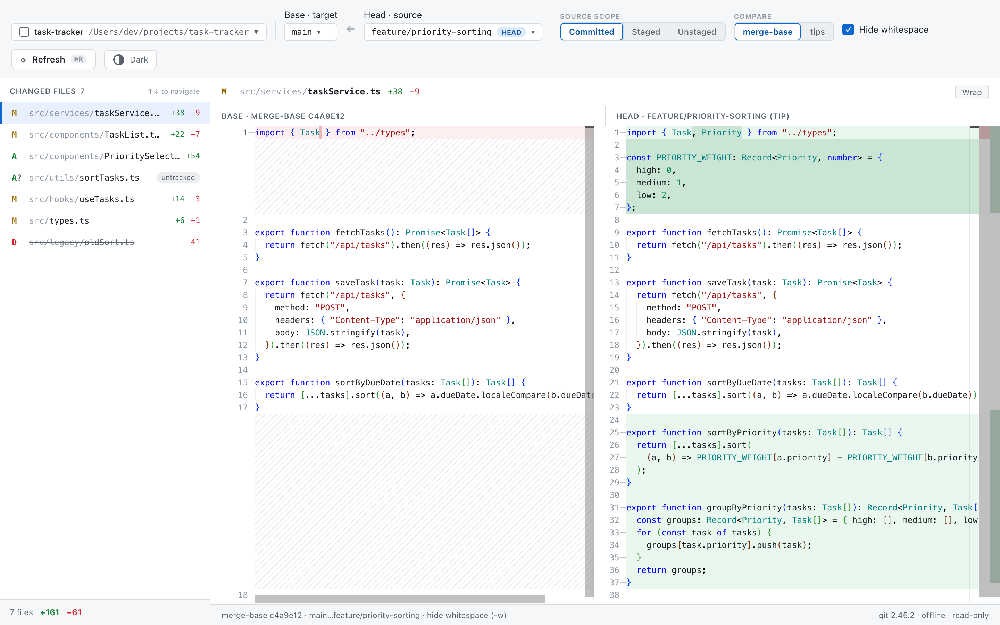
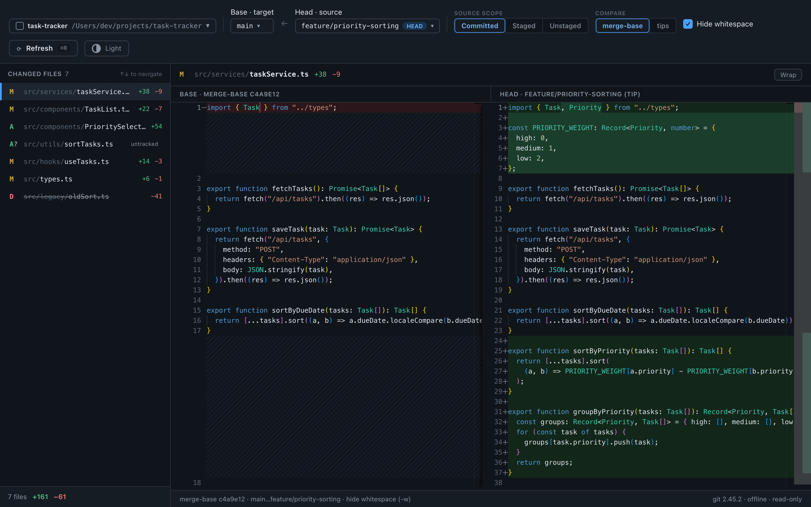

# Branch Diff Viewer

[English version here](README.md)

2つのGitブランチ間の差分——コミットしていない変更も含めて——をレビューするためのデスクトップアプリです。

[](https://github.com/AimotoRyosuke/branch-diff-viewer/releases/latest)
[](LICENSE)

**ブランチの本当の差分を確認できます——まだコミットしていない変更も含めて。**

GitHub のPR差分はpush済みの内容しか見せてくれません。Branch Diff Viewerは、あなたのブランチとマージ先の間にある本当の・現在の差分を、実際のワーキングツリー（未コミットの変更を含む）と比較して表示します。コミットする前にマージ先との差分を確認できます。





## 目次

- [特徴](#特徴)
- [インストール](#インストール)
- [使い方](#使い方)
- [仕組み](#仕組み)
- [開発](#開発)
- [制限事項](#制限事項)
- [ライセンス](#ライセンス)

## 特徴

- **完全オフライン・厳格な読み取り専用** — テレメトリなし、自動アップデートなし、ネットワークアクセス一切なし。アプリがリポジトリに書き込むことはありません：`git add`なし、ロックなし、設定変更なし。
- **PRと同じ精度の差分** — デフォルトの*merge-base*比較では、ブランチが分岐して以降の変更のみを表示し、GitHubがプルリクエストで表示する内容と一致します。*tips*に切り替えると両ブランチの先端同士を直接比較できます。
- **3つのソーススコープ** — コミット済みの変更のみ、コミット済み+ステージ済み、または未追跡ファイルを含む完全なワーキングツリーのいずれかで比較できます。
- **空白の無視（Hide whitespace）** — GitHub相当の`-w`挙動：空白のみの変更は、レンダリングされた差分だけでなく、ファイル一覧や+/−カウントからも除外されます。デフォルトで有効、切り替え可能です。
- **Monacoによる差分表示** — VS Codeのサイドバイサイド差分エディタによる、シンタックスハイライト・ワードラップ・ライト/ダークテーマ対応。ローカルにバンドルされており、CDNからの読み込みは一切ありません。
- **大きな差分でも安全** — ファイルの内容はファイルごとに遅延読み込みされ、1MBを超えるファイルは明示的な「Load anyway」操作が必要で、ファイル一覧は仮想化されています。

## インストール

### ダウンロード（macOS）

[Releasesページ](https://github.com/AimotoRyosuke/branch-diff-viewer/releases/latest)から最新の`.dmg`を取得して開き、アプリをApplicationsフォルダにドラッグしてください。

このアプリはまだコード署名されていないため、初回起動時にmacOSのGatekeeperが「開発元が未確認」という警告でブロックします。開くには：Applications内のアプリを右クリック（またはControlキーを押しながらクリック）し、**開く**を選択、ダイアログで**開く**を確認してください。これは初回のみ必要です。

WindowsとLinuxはスタック上はサポートされていますが、ビルドはまだ検証されていません。

### ソースからビルド

前提条件：[Rust](https://rustup.rs/)（stable）、Node.js 20+、[Tauri v2](https://tauri.app/start/prerequisites/)のプラットフォーム前提条件。実行時には`git`が`PATH`上にある必要があります。

```bash
npm install
npm run tauri build   # src-tauri/target/release/bundle/ 以下にバンドルされます
```

## 使い方

1. **Choose repository…** — 任意のローカルGitリポジトリを選択します（最近使ったプロジェクトは記憶されます）。
2. **Base / Head** — マージ先（例：`main`、`origin/main`）と比較元のブランチを選択します。ローカルブランチとリモート追跡ブランチの両方が一覧表示され、リモートの参照は最後のフェッチ時点の内容を反映します——アプリ自体がフェッチすることはありません。
3. **Source scope** — 比較元側にどこまで含めるか：
   | スコープ | 含まれる内容 |
   |---|---|
   | Committed | コミット済みの変更のみ（PR相当） |
   | Staged | コミット済み + ステージ済み（`git add`済み） |
   | Unstaged | コミット済み + ステージ済み + 未ステージ + 未追跡 |
   Staged/Unstagedは、比較元のブランチがチェックアウト中の`HEAD`である場合にのみ選択可能です——ワーキングツリーの変更は他の場所には存在しないためです。
4. **Compare** — `merge-base`（デフォルト、PR方式の三点比較）または`tips`（単純な二点比較）。
5. ファイルをクリックすると差分が表示されます。<kbd>↑</kbd>/<kbd>↓</kbd>でファイル間を移動、<kbd>⌘R</kbd>でリフレッシュします。ウィンドウがフォーカスを取り戻し、かつリポジトリに変更があった場合は自動的にリフレッシュされます。

## 仕組み

すべての差分はシステムの`git`によって計算されます（直接起動され、シェルを経由することはありません）。デフォルトのmerge-base比較では、アプリはまずフォークポイントを明示的に解決します：

```
MB = git merge-base <target> <source>
```

| スコープ | merge-base比較 | tips比較 |
|---|---|---|
| Committed | `git diff MB <source>` | `git diff <target> <source>` |
| Staged | `git diff --cached MB` | `git diff --cached <target>` |
| Unstaged | `git diff MB` | `git diff <target>` |

未追跡ファイルは`git ls-files --others --exclude-standard`によって別途マージされます（最大100件まで）。すべての呼び出しは`--no-ext-diff`、`core.fsmonitor=false`、`GIT_OPTIONAL_LOCKS=0`付きで実行されるため、信頼できないリポジトリを開いても任意のコマンドが実行されたりロックが取得されたりすることはありません。

## 開発

Tauri v2（Rustバックエンド）+ React + TypeScript + Vite、差分描画にはMonaco Editorを使用しています。

```bash
npm run tauri dev     # ホットリロード付きで実行
npm run build         # 型チェック + フロントエンドのビルド
cd src-tauri && cargo test   # バックエンドの単体テスト（実際の一時Gitリポジトリに対して実行）
```

## 制限事項

- アプリはフェッチを行いません。リモート追跡ブランチは最後の`git fetch`時点の情報のみです（最後のフェッチ時刻はブランチピッカーに表示されます）。
- 1MBを超えるファイルは自動的には差分表示されません（ファイルごとに明示的な「Load anyway」操作が必要）。
- 未追跡ファイルは最大100件まで表示され、それ以降は「+N more」としてまとめられます。
- エディタでの差分計算は、病的な入力の場合5秒後にハイライトなしのサイドバイサイド表示にフォールバックします。
- シャロークローンでは、merge-baseが欠落または誤解を招く結果になることがあり、その場合tips比較への切り替えを促す警告が表示されます。

## ライセンス

MIT
