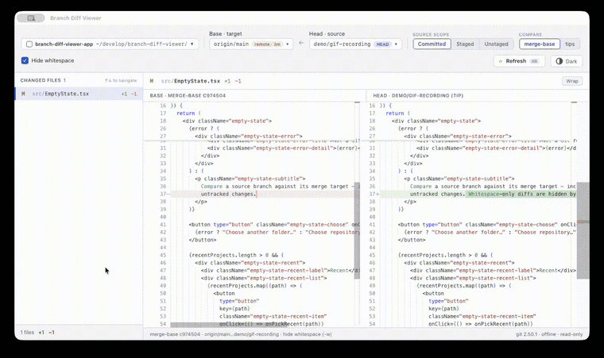

# Branch Diff Viewer

**A desktop app for reviewing the real diff between two Git branches — including the changes you haven't committed yet**

[](https://github.com/AimotoRyosuke/branch-diff-viewer/releases/latest)
[](https://github.com/AimotoRyosuke/branch-diff-viewer/releases/latest)
[](LICENSE)

English | [日本語](README.ja.md)



GitHub's PR diff only shows what you've pushed. Branch Diff Viewer shows the actual, current difference between your branch and its merge target, comparing against your real working tree, uncommitted changes included. Check the diff against your merge target before you even commit.

## Table of contents

- [Features](#features)
- [Install](#install)
- [Usage](#usage)
- [Limitations](#limitations)
- [How it works](#how-it-works)
- [Development](#development)
- [License](#license)

## Features

- **Three source scopes** — compare using committed changes only, committed + staged, or the full working tree including untracked files.
- **PR-accurate diffs** — the default *merge-base* comparison shows only the changes on your branch since it diverged, matching what GitHub shows for a pull request. Switch to *tips* to compare both branch heads directly.
- **Hide whitespace** — GitHub-equivalent `-w` behavior: whitespace-only changes disappear from the file list and the +/− counts, not just the rendered diff. On by default, toggleable.
- **Monaco diff view** — VS Code's side-by-side diff editor with syntax highlighting, word wrap, and light/dark themes. Bundled locally; nothing is loaded from a CDN.
- **Fully offline, strictly read-only** — no telemetry, no auto-update, no network access at all. The app never writes to your repository: no `git add`, no locks, no config changes.
- **Safe with big diffs** — file contents are loaded lazily per file, files over 1 MB require an explicit "Load anyway", and the file list is virtualized.

## Install

### Download (macOS)

Grab the latest `.dmg` from the [Releases page](https://github.com/AimotoRyosuke/branch-diff-viewer/releases/latest), open it, and drag the app to Applications.

The app isn't code-signed yet, so macOS Gatekeeper will block the first launch with an "unidentified developer" warning. To open it anyway: right-click (or Control-click) the app in Applications, choose **Open**, then confirm **Open** in the dialog. This is only needed the first time.

Windows and Linux are supported by the stack but bundles have not been verified yet.

### Build from source

Prerequisites: [Rust](https://rustup.rs/) (stable), Node.js 20+, and the platform prerequisites for [Tauri v2](https://tauri.app/start/prerequisites/). `git` must be on your `PATH` at runtime.

```bash
npm install
npm run tauri build   # bundles under src-tauri/target/release/bundle/
```

## Usage

1. **Choose repository…** — pick any local Git repository (recent projects are remembered).
2. **Base / Head** — select the merge target (e.g. `main`, `origin/main`) and the source branch. Local and remote-tracking branches are both listed; remote refs reflect the last fetch — the app never fetches.
3. **Source scope** — how much of the source side to include:

   | Scope     | Includes                                  |
   | --------- | ----------------------------------------- |
   | Committed | committed changes only (PR equivalent)    |
   | Staged    | committed + staged (`git add`-ed)         |
   | Unstaged  | committed + staged + unstaged + untracked |

   Staged/Unstaged are only available when the source branch is the checked-out `HEAD` — working-tree changes don't exist anywhere else.
4. **Compare** — `merge-base` (default, PR-style three-dot) or `tips` (plain two-dot).
5. Click a file to view its diff. <kbd>↑</kbd>/<kbd>↓</kbd> moves through files, <kbd>⌘R</kbd> refreshes. The view also refreshes automatically when the window regains focus and the repository has changed.

## Limitations

- The app never fetches; remote-tracking branches are only as fresh as your last `git fetch` (the last fetch time is shown in the branch picker).
- Files over 1 MB are not diffed automatically (explicit "Load anyway" per file).
- At most 100 untracked files are listed; the rest are summarized as "+N more".
- Diff computation in the editor falls back to unhighlighted side-by-side view after 5 seconds on pathological inputs.
- Shallow clones can produce a missing or misleading merge-base; a warning suggests switching to tips comparison.

## How it works

All diffs are computed by your system `git` (spawned directly, never through a shell). For the default merge-base comparison the app first resolves the fork point explicitly:

```
MB = git merge-base <target> <source>
```

| Scope     | merge-base compare     | tips compare                 |
| --------- | ---------------------- | ---------------------------- |
| Committed | `git diff MB <source>` | `git diff <target> <source>` |
| Staged    | `git diff --cached MB` | `git diff --cached <target>` |
| Unstaged  | `git diff MB`          | `git diff <target>`          |

Untracked files are merged in separately via `git ls-files --others --exclude-standard` (capped at 100 entries). Every invocation runs with `--no-ext-diff`, `core.fsmonitor=false`, and `GIT_OPTIONAL_LOCKS=0`, so opening an untrusted repository cannot execute arbitrary commands or take locks.

## Development

Tauri v2 (Rust backend) + React + TypeScript + Vite, with Monaco Editor for diff rendering.

```bash
npm run tauri dev     # run with hot reload
npm run build         # type-check + bundle frontend
cd src-tauri && cargo test   # backend unit tests (run against real temp git repos)
```

Bug reports and feature requests are welcome on [Issues](https://github.com/AimotoRyosuke/branch-diff-viewer/issues) — pull requests too.

## License

[MIT](LICENSE)
